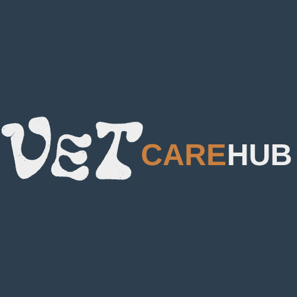

# VetCare Hub

VetCare Hub è una web app progettata per veterinari, che consente di gestire gli animali a loro carico, tenendo traccia delle informazioni personali di ciascun animale e registrando uno storico degli interventi effettuati (vaccini o terapie).

## Tech

Backend: Spring

Frontend: HTML, CSS, JavaScript

IDE: IntelliJ IDEA

Database: XAMPP

## Installation

Clona il repository

git clone https://github.com/AU94-16/veterinari

Importa il progetto in IntelliJ IDEA

Crea sul tuo PHPmyAdmin un nuovo database 'vet_clinic'

Importa database  - ! Il DB è assente di immagini causa sovradimensionamento per l'import ! -

Avvia l'applicazione

Apri il browser e inserisci nella barra di ricerca: localhost:8080

## Features

- Gestione degli animali: creazione e aggiornamento delle informazioni personali di ogni animale.
- Storico interventi: Registrazione delle date e del tipo di intervento (vaccino o terapia).
- Gestione utenti: I veterinari possono acquistare un account per accedere alla piattaforma e gestire i propri pazienti.

## Color Reference

| Color      | Hex                                                                |
|------------| ------------------------------------------------------------------ |
| Navbar     |  #2D3F4E |
| Details    |  #C98040 |
| Background |  #F8F8F8 |

Logo:

Scritta:

## Authors

- [@steph-05](https://github.com/steph-05)
- [@Carmen-Della-Monica](https://github.com/Carmen-Della-Monica)
- [@Luana-Giordano](https://github.com/Luana-Giordano)
- [@n-emme](https://github.com/n-emme)
- [@AU94-16](https://github.com/AU94-16)

## Contributing

Se vuoi contribuire a VetCare Hub, sentiti libero di aprire una issue o una pull request su GitHub.

